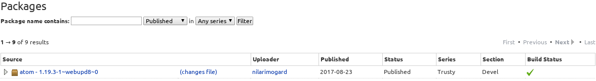

# kali-markdown-insert-screenshot

A lightweight Atom plugin for inserting interactive screenshots into Markdown files from Kali linux.

This plugin has been forked from https://github.com/cavaunpeu/markdown-insert-screenshot

## About

This plugin uses the `import` command from ImageMagick to automatically insert a screenshot into a markdown file.

See the installation section below.

## How to use it

### Assumptions

Since I modified this code for myself, I made some pretty opinionated choices for how it would work.

1. Screenshots are placed in a folder called `screenshots` next to the current file.
2. Names for screenshot files are sanitized so that only characters from `/a-zA-Z0-9\-_/` are allowed. Any other character is replaced with a `_`.
3. Images are `.png` files, and an epoch timestamp is included in the filename.

### Usage without a description.

Either:
  - Right click where you want your screenshot to appear, and select `Take screenshot and save to relative destination` or
  -  Place your cursor where you want the screenshot to appear and enter `alt-i`

Your cursor should change and you can alt-tab to a different window, drag the cursor to grab a section of the screen and a file will be saved with a name like `1503643021492.png` in the `screenshots` folder.

Then the following text will be inserted into your markdown ``.

Then hit enter so your markdown preview will update.

### Usage with a description

1. Type a short description of the screenshot you want to capture, ie: `root shell of web server`.
2. Highlight your description, Then either:
 - right click and select `Take screenshot and save to relative destination`.
 - Enter `alt-i`

Your cursor should change and you can alt-tab to a different window, drag the cursor to grab a section of the screen and a file will be saved with a name like `root_shell_of_web_server-1503676385263.png` in the `screenshots` folder.

Then the following text will be inserted into your markdown ``

Then hit enter so your markdown preview will update.

## Installation on OSCP provided Kali linux

### Installing atom in 32 bit kali.

**Note for OSCP Students**: [OSCP Documents](https://support.offensive-security.com/#!pwk-kali-vm.md#Updating_the_PWK_VM) say that the VMs provided do not need to be updated, and although they can be, such updates could introduce new bugs, etc. It is encouraged that you **take a snapshot before installing Atom**. I found the procedure below to work without updating any software, but that may not be the case in the future.

Atom is distributed as a 64 bit debian package on the Atom website, but that won't work inside the OSCP provided version of Kali linux. There is a PPA for 32-bit builds of Kali called `webup8team/atom` but that PPA is for Ubuntu, and Kali will throw an error if you try to add it.

1. Go to [https://launchpad.net/~webupd8team/+archive/ubuntu/atom/+packages](https://launchpad.net/~webupd8team/+archive/ubuntu/atom/+packages) and expand the atom version you would like to download. 
2. After clicking the triangle on the right, select the i386 version to download it. 
3. After downloading the `.deb` file, install it with dpkg, which likely won't work and will show dependency problems.
  - `dpkg -i atom_1.19.3-1~webupd8~0_i386.deb`
4. Resolve the dependency problems using apt-get and enter `Y` to install additional packages.
  - `apt-get update && apt-get install -f`

Then proceed to installing the package.

### Installing the package

1. Make a directory for this package to live where you won't accidently delete it (like in downloads)
  - `mkdir ~/support`
2. Enter the directory and clone this repository to it:
  - `cd ~/support`
  - `git clone https://github.com/amccormack/markdown-insert-screenshot.git`
3. Enter the repository to link and install dependencies.
  - `cd markdown-insert-screenshot`
  - `apm link`
  - `apm install`

Now open or restart Atom and check to see that it works!
